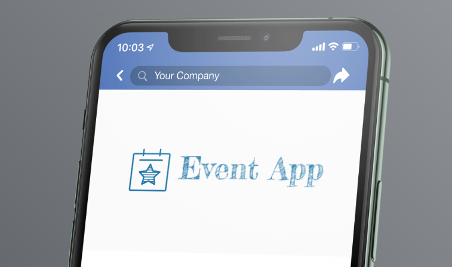

# EVENTS BACKEND


 

## Overview
Events backend application is a comprehensive platform designed to manage various aspects of event organization, registration, and user engagement. Here's a breakdown of its key features and functionalities:

## User Management
- Users can register and authenticate using various methods such as email/password, Google authentication, or other social media platforms.
- User profiles are customizable, allowing individuals to provide details such as email, phone number, gender, interests, and location.
- Users have the option to specify their preferences regarding event updates, reminders, networking opportunities, notifications, profile visibility, and more.

## Event Organization
- Organizers can create and manage events with detailed information including name, description, image, date, time, location, ticket pricing, event type, registration closing date, and available tickets.
- Events can be categorized using tags to facilitate easy search and filtering.
- Each event can have a designated organizer who manages its details and attendee interactions.

## Event Registration
- Users can browse through the list of available events and register for those of interest.
- The application tracks event registrations and attendee details, allowing organizers to manage attendee lists effectively.
- Registration closing dates ensure that organizers can plan and prepare adequately for the event.

## User-Event Interaction
- The platform supports a many-to-many relationship between users and events, enabling efficient management of event registrations and attendee lists.
- Users can receive updates and reminders about upcoming events based on their preferences, enhancing their overall event experience.

## User Preferences
- Users have the flexibility to customize their notification settings, including email notifications, push notifications, and event-related updates.
- Preferences regarding networking opportunities, event details visibility, and group participation can be tailored to suit individual preferences.

Overall, the event backend application serves as a robust solution for organizing, managing, and participating in a wide range of events, offering users a seamless and personalized experience tailored to their preferences and interests.

## Prisma Usage
The database has already been setup. The only thing you need to is include this in any controller file you are working on:
```
import { PrismaClient } from "@prisma/client";
const prisma = new PrismaClient()
```

Also run:
```
  npx prisma studio
```
To view added tables and content. You can also manipulate fields when necessary.

Look at prisma [docs](https://www.prisma.io/docs/concepts/components/prisma-client/crud) for CRUD operations.

## Installation
1. Clone this repository:
```bash
 git clone https://github.com/Uzo-Felix/Events-Backend.git
```
2. Install dependencies:
```bash
  yarn install
```
3. Create .env file and add keys

4. Prisma generate
```
  npx prisma generate
```
5. Start the server:
  ```bash
    yarn start:dev
  ```

## Usage
After looking at what your ticket create a branch checkout into that branch locate your route and controller and add the logic. After testing push to your branch and create a PR on github. 


## API URL
You can access the API at `https://events-api.onrender.com/api/`
